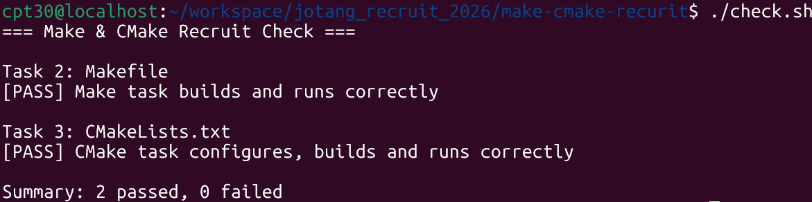

# Task 4：思考题

## 1. Make 和简单的 build.sh 有什么区别？

`build.sh`只能从头到尾全部重新编译，而 Make 能根据文件修改时间实现增量编译并自动维护依赖关系。

## 2. CMake 是编译器吗？执行 `cmake --build build` 时，最终是谁在编译 C 源文件？

不是，CMake 只是生成构建文件的工具，最终真正编译 C 源文件的是gcc。

## 3. 为什么不希望每次都重新编译所有 `.c` 文件？

因为全量编译耗时极长且浪费 CPU 资源，只重新编译修改的文件能大幅节省等待时间，提升开发调试效率。

